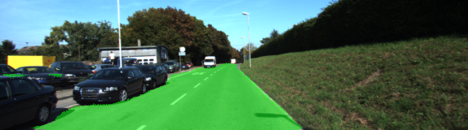
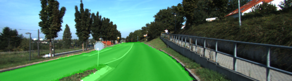
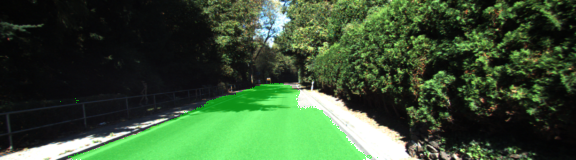

# CarND-Semantic-Segmentation

## Table Content: ##
- [Objective](#objective)
- [Results](#results)
- [Setup](#setup)
- [How to run](#howto)
- [Directory Structure](#structure)
- [Model](#model)


## Objective: <a name="objective"></a>

In this project, NVDIA GTX 1080 TI graphics card used for training. There are number of hyper parameters, epochs, batch sizes, learning rates, and dropouts and here are the optimal parameters are found as follow:

    -Epochs: 25
    -Batch Size: 1
    -Learning rate: 0.0001
    -Dropouts: 0.2

## Results <a name="results">

The following images of the output of the results of Fully Convolutional Network for Semantic Segmentation:





### Setup <a name="setup"></a>
##### Frameworks and Packages
Make sure you have the following is installed:
 - [Python 3](https://www.python.org/)
 - [TensorFlow](https://www.tensorflow.org/)
 - [NumPy](http://www.numpy.org/)
 - [SciPy](https://www.scipy.org/)
##### Dataset
Download the [Kitti Road dataset](http://www.cvlibs.net/datasets/kitti/eval_road.php) from [here](http://www.cvlibs.net/download.php?file=data_road.zip).  Extract the dataset in the `data` folder.  This will create the folder `data_road` with all the training a test images.

### How to run <a name="howto"></a>
	python main.py

## Directory Structure <a name="structure"></a>
The directory structure of this repository is as follows:

```
root
|   
|   README.md
|   data
|   images
|   main.py
|   helper.py 
|   project_tests.py
|   
|__returns
|
|
|
|
|___images
|   |
|   |  rightTurn.gif
|   |  leftTurn.gif
|   |  slowDown.gif
|
|
|___data
   |   data_road
   |   vgg
      
```
## Model <a name="model"></a>
The Vgg16 model achieves 92.7% top-5 test accuracy in ImageNet , which is a dataset of over 14 million images belonging to 1000 classes. As shown below, input image size 224x224x3 followed by multiple convolution and max pooling layers.  


For this project, pretrained vgg16 model is used and to retain the spatial information the model is de-convoluted. Input image, layer 3, layer 4, and layer 4 are trained using new weight information. Implemented model is shown below. 


